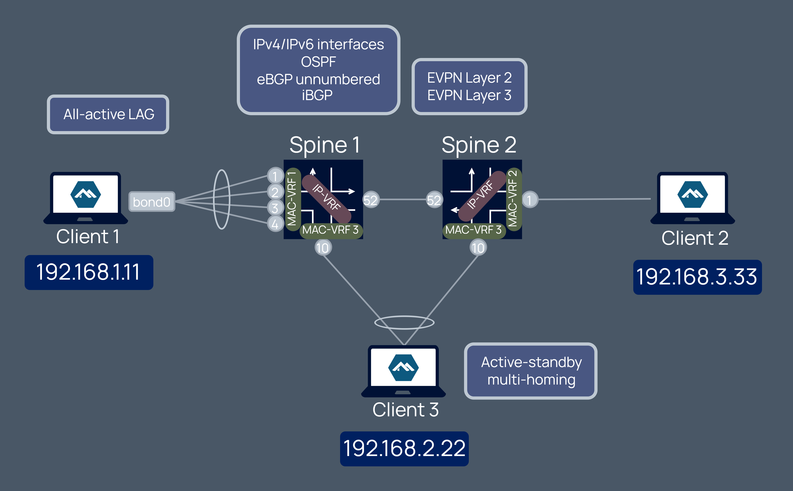

# Demonstrating SR Linux features
The purpose of this lab is to demonstrate several Nokia SR Linux features. Beware that the topology does not propose a coherent use case, and simply provides the infrastructure to show different configurations. 

The diagram below illustrates the different elements and protocols deployed with this lab material.



## Deploying the lab
The lab is deployed with [containerlab](https://containerlab.dev) project where [`feat.clab.yml`](feat.clab.yml) file declaratively describes the lab topology.

```bash
# deploy the lab
containerlab deploy 
```

Once the lab is completed, it can be removed with the destroy command.

```bash
# destroy the lab
containerlab destroy 
```

## Accessing the network elements
After deploying the lab, the nodes will be accessible. To access a network element, simply use its hostname as described in the table displayed after execution of the deploy command.
```
ssh admin@clab-feat-srl1
```
The Linux CE clients don't have SSH enabled. In order to access them, use `docker exec`.
```
docker exec -it clab-feat-client1 bash
```

## Configuration
All nodes come preconfigured thanks to startup-config setting in the topology file [`feat.clab.yml`](feat.clab.yml). Those configuration files can be found in [`configs`](/configs). 